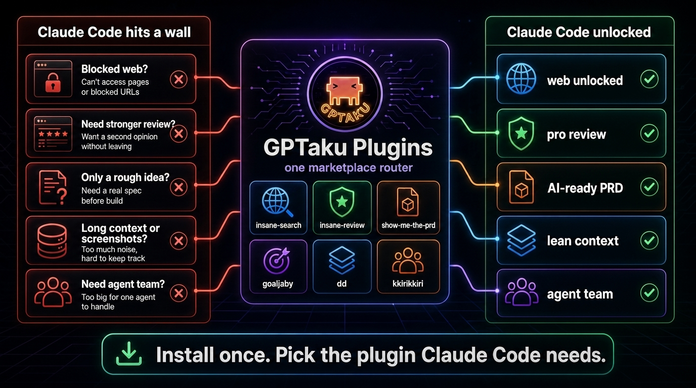

[English](README.md) | 한국어 | [中文](README.zh.md) | [日本語](README.ja.md) | [Español](README.es.md)

<div align="center">

# GPTaku Plugins

**원하는 걸 구구절절 설명하지 마세요 — Claude Code에게 직접 시키세요.**

차단된 웹페이지 검색, 어떤 URL에서든 디자인 시스템 추출, 강력한 코드 리뷰, 대략적인 아이디어를 PRD로 자동 변환까지 — 이 모든 것을 Claude Code 안에서 해결하는 15개의 플러그인.

<p>
  <a href="#-플러그인-카테고리-일람"></a>
  <a href="https://docs.anthropic.com/en/docs/claude-code"></a>
  <a href="LICENSE"></a>
  <a href="https://github.com/fivetaku/insane-search/stargazers"></a>
</p>

<!-- 라이트/다크 테마 지원 히어로 이미지 -->
<picture>
  <source media="(prefers-color-scheme: dark)" srcset="assets/hero-purpose-wallbreak.png">
  <source media="(prefers-color-scheme: light)" srcset="assets/hero-purpose-wallbreak.png">
  
</picture>

<sub><a href="#-설치">설치</a> · <a href="#-대표-플러그인--insane--시리즈">대표 플러그인</a> · <a href="#-플러그인-카테고리-일람">전체 플러그인</a> · <a href="#-인증-및-설정-보안--자격-증명">인증 및 설정</a></sub>

</div>

---

## ⚡ 설치

Claude Code 안에서 아래 명령을 실행하세요:

```bash
# 1) 마켓플레이스 등록 (처음 한 번만)
/plugin marketplace add https://github.com/fivetaku/gptaku_plugins.git

# 2) 가장 진입장벽이 낮은 대표 플러그인 설치
/plugin install insane-search@gptaku-plugins

# 3) 앱 재시작 없이 바로 적용
/reload-plugins
```

**처음 방문하셨나요? `insane-search`부터 설치해 보세요.** 대부분의 플러그인은 추가 설정 없이 바로 작동하지만, 일부 플러그인은 외부 서비스 인증이 필요합니다 ([인증 및 설정 섹션 참고](#-인증-및-설정-보안--자격-증명)).

---

## 🔥 대표 플러그인 — insane-* 시리즈

> GPTaku Plugins의 4대 핵심 플러그인입니다. 다른 도구들이 해결하지 못하고 멈추는 지점을 뚫어냅니다.

### 🔎 insane-search · <a href="https://github.com/fivetaku/insane-search/stargazers"></a>
**Claude Code가 차단된 웹페이지를 못 읽을 때, 기어이 뚫어서 가져옵니다.**
WAF, 403, CAPTCHA, 로그인 장벽에 막히면 공개 API 리더, 신디케이션 게이트웨이, TLS 임퍼스네이션, 실제 헤드리스 브라우저까지 하나씩 시도해 뚫습니다. API 키는 필요 없습니다.

```bash
/plugin install insane-search@gptaku-plugins
```
> **Try:** *"Find what people are saying about Claude Code on Reddit and summarize the top threads."*

### 🎨 insane-design
**어떤 웹사이트에서든 디자인 시스템을 단 한 줄의 명령으로 추출합니다.**
실제 CSS를 읽어 색상·타이포·간격·둥글기·그림자·폰트를 그대로 뽑아냅니다. 결과는 깔끔한 디자인 토큰과 `design.md`, 그리고 클릭으로 복사되는 HTML 리포트로 나옵니다.

```bash
/plugin install insane-design@gptaku-plugins
```
> **Try:** *"Extract the design system from https://stripe.com"*

### 🧠 insane-review
**GPT-5.5 Pro는 API가 없습니다. 하지만 이 플러그인은 Claude Code 안에서 그대로 호출해 씁니다.**
`repomix`로 관련 코드만 골라 패킹한 뒤, 로그인된 ChatGPT Pro 웹 세션에 그대로 넣어 라인 단위 리뷰를 받아옵니다.

```bash
/plugin install insane-review@gptaku-plugins
```
> **Try:** *"Have GPT-5.5 Pro review the auth flow in src/auth."*

### 📚 insane-research
**질문 한마디로 출처가 명시된 멀티에이전트 연구 보고서를 작성합니다.**
질문 범위를 먼저 잡고, 전문 리서치 에이전트를 풀어 소스 품질을 매기고 교차 검증한 다음, 마크다운 보고서로 정리합니다. 7단계 파이프라인.

```bash
/plugin install insane-research@gptaku-plugins
```
> **Try:** *"Research the best vector database for RAG in 2026, with citations."*

---

## 🧭 상황별 선택 가이드 (내가 부딪힌 벽에 따라)

<div align="center">
  
</div>

<table width="100%">
<tr>
  <td><strong>Claude Code가 이 작업을 하다가 막힌다면...</strong></td>
  <td width="25%"><strong>이 플러그인을 설치하세요</strong></td>
</tr>
<tr>
  <td>차단된 웹페이지, 빈 HTML, 또는 특정 플랫폼의 웹 콘텐츠를 읽어야 할 때</td>
  <td><code>insane-search</code></td>
</tr>
<tr>
  <td>더 강력한 모델의 서브 코드 리뷰가 필요할 때</td>
  <td><code>insane-review</code></td>
</tr>
<tr>
  <td>마음에 드는 웹사이트 스타일을 그대로 재사용하고 싶을 때</td>
  <td><code>insane-design</code></td>
</tr>
<tr>
  <td>철저한 검증과 출처 인용이 포함된 심층 리서치가 필요할 때</td>
  <td><code>insane-research</code></td>
</tr>
<tr>
  <td>생각만 있고 구체적인 제품 스펙(PRD)문서가 없을 때</td>
  <td><code>show-me-the-prd</code></td>
</tr>
<tr>
  <td>작성된 PRD를 기반으로 검증된 <code>/goal</code> 작업 계약을 체결하고 싶을 때</td>
  <td><code>goaljaby</code></td>
</tr>
<tr>
  <td>골이 진짜 끝나기 전에 조용히 멈춰버릴 때</td>
  <td><code>insane-loop</code></td>
</tr>
<tr>
  <td>폴더마다 규칙·훅·도구 세팅을 매번 손으로 하는 상황</td>
  <td><code>insane-harness</code></td>
</tr>
<tr>
  <td>대규모 개발 작업을 여러 워커로 나누어 동시 실행하고 싶을 때</td>
  <td><code>pumasi</code> 또는 <code>kkirikkiri</code></td>
</tr>
<tr>
  <td>스크린샷, 긴 로그, 혹은 복사해 둔 참고 데이터를 직접 넘기고 싶을 때</td>
  <td><code>dd</code></td>
</tr>
<tr>
  <td>외부 라이브러리나 API 공식 문서를 기반으로 질문하고 싶을 때</td>
  <td><code>docs-guide</code></td>
</tr>
<tr>
  <td>Gmail, 캘린더, 드라이브, 문서, 스프레드시트 등 구글 서비스를 연동할 때</td>
  <td><code>nopal</code></td>
</tr>
<tr>
  <td>Git과 GitHub 명령어가 어렵게 느껴질 때</td>
  <td><code>git-teacher</code></td>
</tr>
<tr>
  <td>Claude Code와의 협업 방식을 교정하고 성과 보고서를 받고 싶을 때</td>
  <td><code>vibe-sunsang</code></td>
</tr>
<tr>
  <td>나만의 플러그인, 스킬, 또는 전문 에이전트를 빌드하고 싶을 때</td>
  <td><code>skillers-suda</code></td>
</tr>
</table>

---

## 🔒 인증 및 설정 (보안 & 자격 증명)

대부분의 플러그인은 활성화된 Claude Code 세션만 있으면 작동하며, **추가 API 키가 필요 없습니다.** 외부 서비스 연동이 필요한 일부 예외는 아래와 같습니다:

<table width="100%">
<tr>
  <td width="25%"><strong>Claude Code 전용</strong><br><em>(인증 불필요)</em></td>
  <td><code>insane-search</code>, <code>insane-design</code>, <code>insane-research</code>, <code>docs-guide</code>, <code>git-teacher</code>, <code>show-me-the-prd</code>, <code>goaljaby</code>, <code>insane-loop</code>, <code>kkirikkiri</code>, <code>skillers-suda</code>, <code>vibe-sunsang</code>, <code>dd</code>, <code>insane-harness</code></td>
</tr>
<tr>
  <td width="25%"><strong>Google Workspace OAuth</strong></td>
  <td><code>nopal</code> (구글 계정 및 <code>gws</code> CLI를 통한 최초 1회 로그인 인증 필요)</td>
</tr>
<tr>
  <td width="25%"><strong>브라우저 로그인 필요</strong></td>
  <td><code>insane-review</code> (로그인된 ChatGPT Plus/Pro 웹 세션 이용; API 키 불필요)</td>
</tr>
<tr>
  <td width="25%"><strong>외부 CLI 필요</strong></td>
  <td><code>pumasi</code> (호스트 시스템에 Codex CLI 설치 필요)</td>
</tr>
</table>

모든 플러그인은 오픈 소스입니다. 각 서브모듈의 README에서 구체적인 실행 경계, 스킬 및 의존성을 확인하실 수 있습니다.

---

## 📦 플러그인 카테고리 일람

### 🔎 리서치 및 웹 탐색
<table width="100%">
<tr>
  <td width="25%"><strong><a href="https://github.com/fivetaku/insane-search">insane-search</a></strong></td>
  <td>차단 웹사이트 우회 검색 — API 키 없이 WAF/403/CAPTCHA 돌파.</td>
</tr>
<tr>
  <td width="25%"><strong><a href="https://github.com/fivetaku/insane-research">insane-research</a></strong></td>
  <td>멀티에이전트 심층 리서치 — 소스 검증 및 출처가 표시된 교차검증 보고서 작성.</td>
</tr>
<tr>
  <td width="25%"><strong><a href="https://github.com/fivetaku/docs-guide">docs-guide</a></strong></td>
  <td>공식 문서 기반 고정밀 답변 — llms.txt 표준 및 68개 라이브러리 지원.</td>
</tr>
</table>

### 🎨 디자인 및 코드 품질
<table width="100%">
<tr>
  <td width="25%"><strong><a href="https://github.com/fivetaku/insane-design">insane-design</a></strong></td>
  <td>URL에서 디자인 시스템 추출 — CSS 분석을 통한 디자인 토큰 생성 및 HTML 리포트 출력.</td>
</tr>
<tr>
  <td width="25%"><strong><a href="https://github.com/fivetaku/insane-review">insane-review</a></strong></td>
  <td>ChatGPT Pro 웹 세션을 통한 GPT-5.5 Pro 코드 리뷰 실행 (API 키 불필요).</td>
</tr>
</table>

### 🚀 설계 및 제품 배포
<table width="100%">
<tr>
  <td width="25%"><strong><a href="https://github.com/fivetaku/show-me-the-prd">show-me-the-prd</a></strong></td>
  <td>한 문장에서 설계 시작 — 인터뷰 기반 4대 제품 설계 문서(PRD 등) 작성.</td>
</tr>
<tr>
  <td width="25%"><strong><a href="https://github.com/fivetaku/goaljaby">goaljaby</a></strong></td>
  <td>PRD에서 <code>/goal</code> 실행 계약으로 연결 — 검토용 분석 요약 보고서 제공.</td>
</tr>
<tr>
  <td width="25%"><strong><a href="./plugins/insane-loop">insane-loop</a></strong></td>
  <td>아이디어 → 완성: 문서로 정의된 완성(DoD)까지 <code>/goal</code> 안에서 검증→리뷰→개선 루프.</td>
</tr>
<tr>
  <td width="25%"><strong><a href="https://github.com/fivetaku/pumasi">pumasi</a></strong></td>
  <td>PM 역할의 Claude Code + Codex CLI 병렬 워커들을 통한 대규모 분산 코딩.</td>
</tr>
<tr>
  <td width="25%"><strong><a href="https://github.com/fivetaku/kkirikkiri">kkirikkiri</a></strong></td>
  <td>자연어 명령어 한 줄로 즉석 에이전트 개발팀 자동 조립.</td>
</tr>
</table>

### 🌱 학습 및 환경 고도화
<table width="100%">
<tr>
  <td width="25%"><strong><a href="https://github.com/fivetaku/git-teacher">git-teacher</a></strong></td>
  <td>비개발자 대상 Git/GitHub 온보딩 — 클라우드 비유를 통한 가이드.</td>
</tr>
<tr>
  <td width="25%"><strong><a href="https://github.com/fivetaku/vibe-sunsang">vibe-sunsang</a></strong></td>
  <td>AI 멘토 에이전트 — 대화 히스토리 분석 피드백 및 성장 보고서 발행.</td>
</tr>
<tr>
  <td width="25%"><strong><a href="https://github.com/fivetaku/skillers-suda">skillers-suda</a></strong></td>
  <td>4명의 전문 에이전트의 토론을 거쳐 아이디어를 작동하는 스킬로 고도화.</td>
</tr>
</table>

### ⚙️ 워크스페이스 연동
<table width="100%">
<tr>
  <td width="25%"><strong><a href="https://github.com/fivetaku/insane-harness">insane-harness</a></strong></td>
  <td>세션 로그로 워크스페이스를 진단하고, 승인 게이트를 거쳐 함께 진화하는 하네스를 적용.</td>
</tr>
<tr>
  <td width="25%"><strong><a href="https://github.com/fivetaku/nopal">nopal</a></strong></td>
  <td>Google Workspace 9대 서비스 오케스트레이션.</td>
</tr>
<tr>
  <td width="25%"><strong><a href="https://github.com/fivetaku/dd">dd</a></strong></td>
  <td>클립보드 텍스트 및 이미지를 대화창 없이 직접 주입 (<code>/dd</code>, <code>/ㅇㅇ</code>).</td>
</tr>
</table>

---

## 요구사항

- **[Claude Code](https://docs.anthropic.com/en/docs/claude-code)** 전용 — Codex, Antigravity 등 기타 터미널 인터페이스 미지원.
- **Windows**: WSL2 환경 필요 (`wsl --install`) · **macOS / Linux**: 즉시 연동 가능.
- 일부 플러그인은 필요 시 의존 도구(`gh`, `yt-dlp`, Playwright MCP 등)를 자동 설치합니다.

## 왜 GPTaku인가?

각 플러그인은 AI 협업 과정에서 한 번씩 부딪히게 되는 구체적인 한계들 — 차단된 페이지, 막막한 기획 문서, 역공학이 필요한 웹 디자인 등을 해결합니다. 한글 우선 설계, 다국어 지원, 독립적 조합 구조, 투명한 인증 절차로 제작되었습니다.

**벽 하나씩, AI Native가 되어갑니다.**

## 라이선스

MIT
